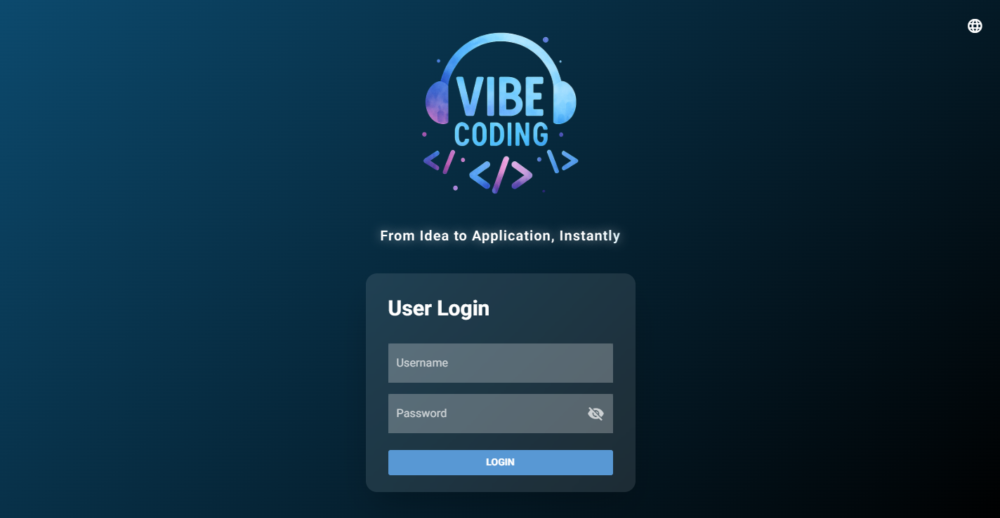
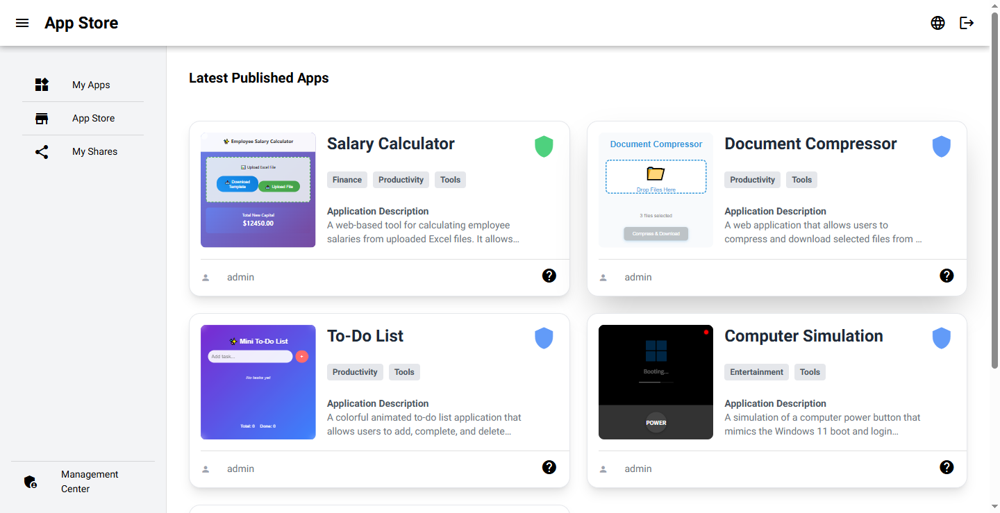
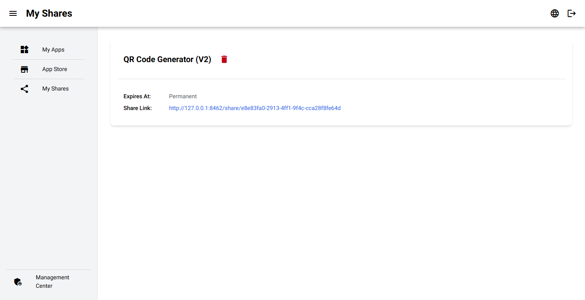
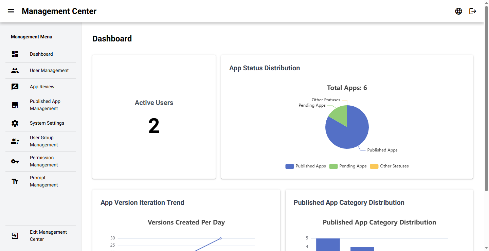
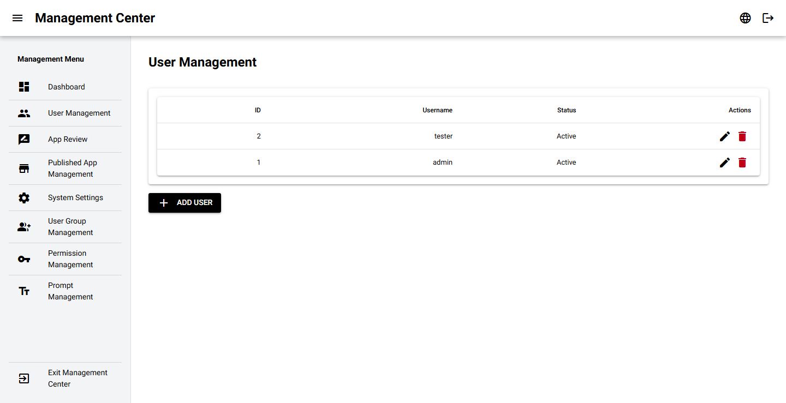
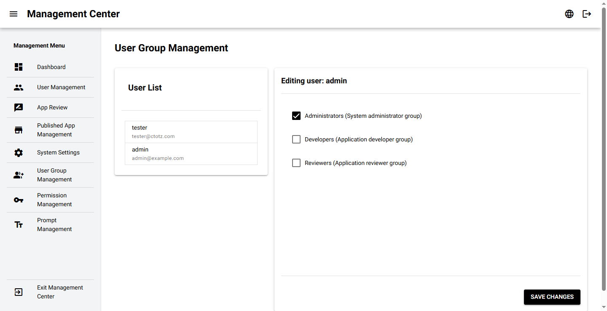
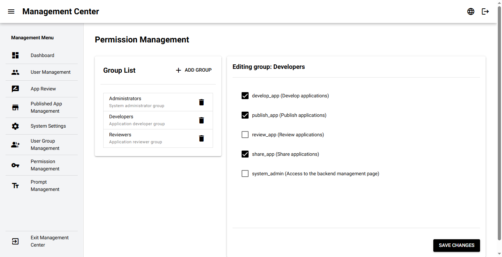
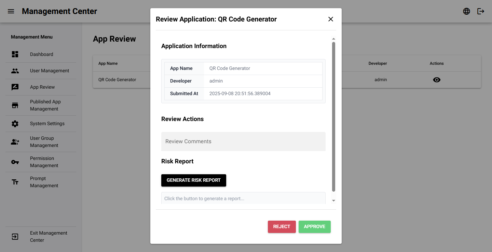
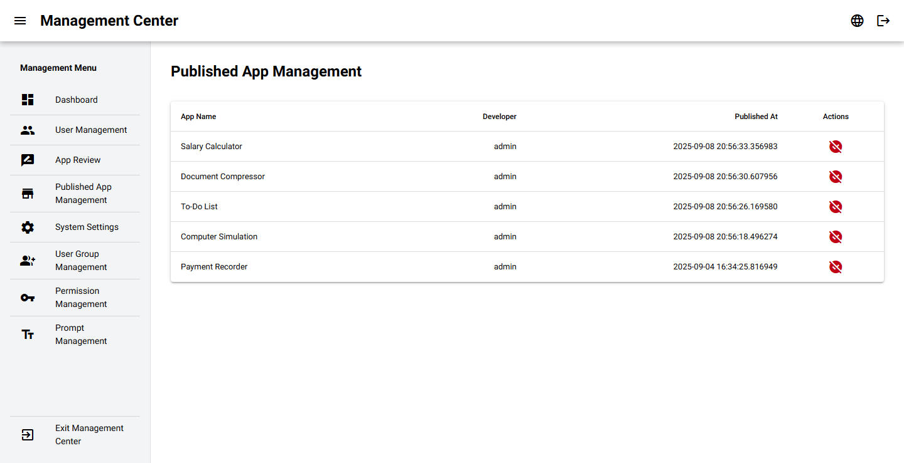
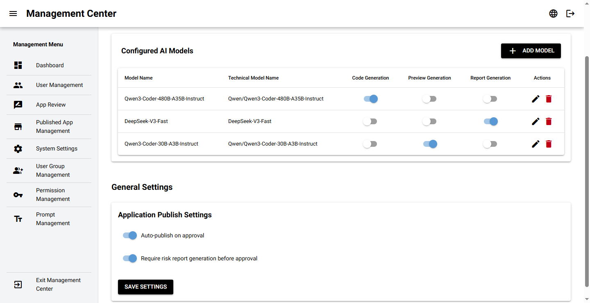

[English](README.md) | [正體中文](README.zh-TW.md) | [简体中文](README.zh-CN.md) | [日本語](README.ja.md) | [한국어](README.ko.md)

# Vibe：AI 驱动的低代码应用程序平台

## 📄 概览

Vibe 是一个动态的、基于 Web 的平台，让用户能利用人工智能的力量来创建、管理和分享单页 Web 应用程序。用户只需描述他们需要的工具或界面，AI 后端便会生成所需
的 HTML、CSS 和 JavaScript 代码。此项目旨在弥合想法与实现之间的差距，实现简单 Web 工具的快速原型设计和部署。

平台提供一个完整的生态系统，包括安全的用户身份验证系统、供开发者管理其创作的工作空间、一个用于浏览和使用已发布应用程序的“应用商店”，以及一个供管理员监督用户、审核提交内容和配置系统的综合管理中心。

## 🖼️ 屏幕截图

| 功能 | 预览 |
| ----------------------- | ----------------------------------------------------- |
| **登录页面** |  |
| **应用商店** |  |
| **我的应用页面** |  |
| **交互式应用编辑器**|  |
| **分享页面** |  |
| **管理仪表板**| |
| **用户管理** | |
| **群组管理** | |
| **权限设置** | |
| **应用审核队列** | |
| **已发布的应用** | |
| **系统设置**| |

## ✨ 主要功能

*   **对话式 AI 开发**：Vibe 的核心是一个交互式的、基于聊天的界面，用户可以在这里将他们的想法变为现实。只需与 AI 对话，描述您想构建的应用程序，请求变更，并逐步完善其功能。AI 会处理编码工作，让您能专注于工具的设计和目的。此过程完全受版本控制，因此您随时可以恢复到先前的状态。

*   **用户与会话管理**：安全的登录系统，具备密码哈希功能。经过身份验证的用户拥有专属的会话和工作空间来管理他们的应用程序。

*   **应用程序生命周期管理**：
    *   **草稿与版本控制**：每次变更都会创建一个新版本，并提供完整的历史记录。用户可以恢复到任何先前的版本。
    *   **审核与批准工作流程**：开发者可以提交他们的应用程序以供审核。管理员可以根据功能和安全性批准或拒绝提交。
    *   **发布**：经批准的应用程序可以“上线”，并将出现在公共的应用商店中，供所有用户访问。

*   **应用商店**：一个供所有用户发现、浏览和使用已发布应用程序的中心平台。每个应用程序都包含描述、预览和开发者信息。

*   **综合管理中心**：一个受权限控制的后端，供管理员和审核人员使用，功能包括：
    *   **系统仪表板**：查看关键统计数据，如用户数量、应用程序状态分布和创建趋势。
    *   **用户管理**：创建、编辑和管理用户、他们的状态和群组成员资格。
    *   **群组与权限控制**：通过将用户分配到具有特定权限（例如 `develop_app`、`review_app`、`system_admin`）的群组，实现细粒度的访问控制。
    *   **AI 设置**：管理 AI 模型、API 密钥和用于不同任务（代码生成、风险分析）的系统级提示。

*   **风险分析与内容审核**：AI 驱动的分析，用于在应用程序发布前识别潜在的安全风险（例如，脚本注入）并对其进行分类。

*   **国际化 (i18n)**：系统支持五种语言：中文(繁体)、中文(简体)、日文、韩文、英文。

## 🏗️ 项目结构

该项目主要由两个主要组件组成，它们与一个数据库和辅助模块协同工作。

*   **`main.py`**：这是应用程序的核心和主要入口点。它负责：
    *   初始化 `NiceGUI` Web 服务器和 UI。
    *   处理所有用户导向的页面，如登录屏幕 (`/login`)、应用程序创建/编辑界面 (`/session/{session_id}`)、应用商店 (`/store`)，以及个人应用管理页面 (`/my-apps`, `/my-shares`)。
    *   管理 AI 交互逻辑，将用户提示发送到 AI 服务并处理生成的 HTML。
    *   提供已发布的应用程序和分享链接。

*   **`management_pages.py`**：此文件定义了整个后端管理界面。它是应用程序的一个独立部分，仅供具有适当权限（`system_admin` 或 `review_app`）的用户访问。其职责包括：
    *   渲染带有系统分析的管理仪表板。
    *   提供用于管理用户、群组和权限的 UI 和逻辑。
    *   定义应用审核工作流程，允许管理员查看提交的应用程序、生成风险报告，并批准或拒绝它们。
    *   处理系统级设置，如 AI 模型设置和提示模板。

这两个文件与 `database.py`（管理 SQLite 数据库中的所有数据持久性）和 `languages.py`（为 UI 提供翻译服务）互动。

## 📋 先决条件

要运行此项目，您需要安装 `requirements.txt` 中列出的 Python 库。

## 🚀 安装

1.  **克隆存储库：**
    ```bash
    git clone https://github.com/felixszeto/nice-vibe-coding.git
    cd nice-vibe-coding
    ```

2.  **安装依赖项：**
    建议使用虚拟环境。
    ```bash
    # 创建并启动虚拟环境（可选但建议）
    python -m venv venv
    source venv/bin/activate  # 在 Windows 上，使用 `venv\Scripts\activate`

    # 安装所需的包
    pip install -r requirements.txt
    ```

## 💻 使用方法

1.  **初始化数据库：**
    首次运行应用程序时，它会自动创建一个 `app_data.db` 文件，其中包含必要的数据表和初始数据，包括一个默认的管理员用户。
    *   **默认管理员凭证**：
        *   用户名：`admin`
        *   密码：`admin123`
    *   **默认用户凭证**：
        *   用户名：`tester`
        *   密码：`admin123`
        *   （此用户具有基本权限，只能使用已发布的应用程序。请使用 `admin` 帐户创建具有不同角色的用户。）

2. **预载示例：**
   数据库预载了一些示例应用程序，以展示平台的功能。登录后，您可以在应用商店中找到它们：
    *   薪资计算器
    *   文件压缩器
    *   待办事项列表
    *   计算机模拟
    *   QR Code 生成器
    *   付款记录器

3.  **运行应用程序：**
    执行 `main.py` 文件以启动 Web 服务器。
    ```bash
    python main.py
    ```
    应用程序默认将在 `http://127.0.0.1:8462` 上提供。

4.  **使用平台：**
    *   **登录**：在浏览器中访问应用程序 URL，并使用管理员凭证或您创建的任何其他用户登录。
    *   **创建应用**：导航至“我的应用”，然后点击“新增”按钮以开始新的创建会话。使用聊天界面描述您想构建的应用程序。
    *   **管理应用**：从“我的应用”页面，您可以查看现有的应用程序，检查其状态（草稿、审核中、已发布），并进入会话进行管理。
    *   **管理功能**：以 `admin` 身份登录，并从侧边栏导航至“管理中心”以访问所有管理功能。

## 🤖 AI 模型建议

为获得最佳性能，我们建议使用以下模型，这些模型可以在管理中心进行设置。不过，也欢迎您尝试任何其他与平台兼容的模型。

*   **代码生成模型**：`DeepSeek-V3.1 / DeepSeek-R1 / Qwen3-Coder-480B / Gemini-2.5-pro / GPT-5`
*   **预览生成模型**：`DeepSeek-V3.1 / DeepSeek-R1 / Qwen3-Coder-480B / Gemini-2.5-pro / GPT-5`
*   **报告生成模型**：`DeepSeek-V3.1 / DeepSeek-R1 / Qwen3-Coder-480B / Gemini-2.5-pro / GPT-5`

祝您构建愉快！

---

## 📜 许可协议

本作品采用 [知识共享署名-非商业性使用 4.0 国际许可协议 (CC BY-NC 4.0)](https://creativecommons.org/licenses/by-nc/4.0/deed.zh) 进行许可。


**您可以自由地：**

*   **分享** — 在任何媒介或格式下复制并重新发布本材料
*   **演绎** — 修改、转换或基于本材料进行创作

**依据下列条件：**

*   **署名** — 您必须给出适当的署名，提供指向本许可协议的链接，同时标明是否（对原始作品）作了修改。您可以用任何合理的方式来署名，但不得以任何方式暗示许可人为您或您的使用背书。
*   **非商业性使用** — 您不得将本材料用于商业目的。

本许可协议不授予您使用许可人商号、商标、服务标志或产品名称的权利，但在描述材料来源及复制许可声明内容时，为合理且惯常的使用方式者，不在此限。